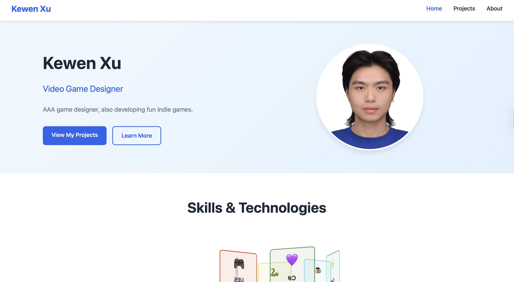

# Personal Homepage

**Author:** Kewen Xu

**Class Link:** https://johnguerra.co/classes/webDevelopment_online_fall_2025/

**Project Objective:**
This project is a modern, responsive personal homepage built entirely with vanilla HTML5, CSS3, and ES6+ JavaScript.
The objective was to create a professional portfolio website that demonstrates mastery of front-end web technologies without relying on frameworks or libraries.

**Screenshot:**

**Key Features**
Responsive Design: Mobile-first approach using CSS Grid and Flexbox  
ES6+ Modules: Modern JavaScript with proper module organization  
Interactive Components: 3D skills visualizer with drag-to-rotate functionality  
Accessibility: Semantic HTML, proper ARIA labels, and keyboard navigation  
Performance: Optimized assets and efficient code structure  
W3C Compliance: Valid HTML5 markup and CSS3  
  
**Instructions to Build/Run:**
1. Clone or download this repository to your local machine.
2. Serve the `HW1` directory with a static file server so ES modules load correctly (e.g., `npx http-server HW1 -p 8080`).
3. Visit `http://localhost:8080/index.html` in your browser.
